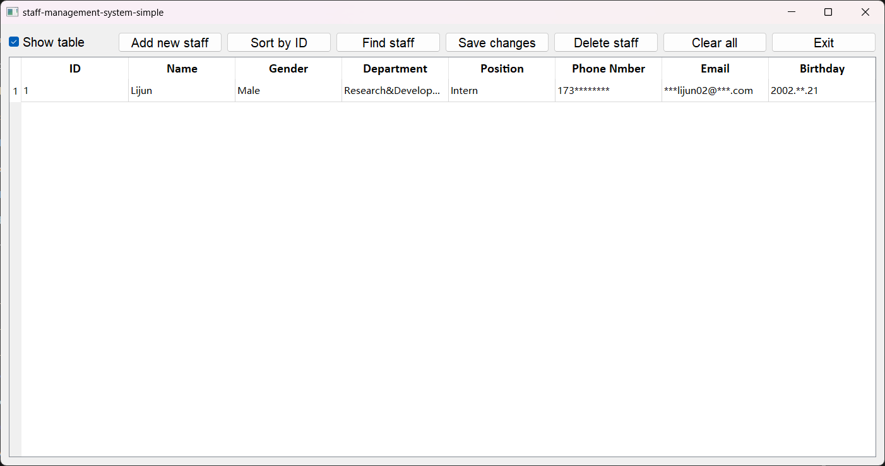

# Stuff-Management-System
## Intro
- An entry-level C++ program for practice.
- Coded in **C++** and **Qt**.
- C++ version combines Python scripts (Pandas) to save and read data as **xlsx file** while Qt version imports and exports as **txt file**.
- To call Python scripts in C++, replace line 194 in *workerManager.cpp* with the absolute address on your computer.

- Release is a Qt version.
## Functions
0. **Show table**: check "Show table" to reveal the table and uncheck to hide the table.
1. **Add new staff**: record information one by on for new employees.
2. **Sort by ID**: ascending order.
3. **Find staff**: search by ID or name.
4. **Save Changes**: click it to record after making changes.
5. **Delete staff**: search by ID or name to delete.
6. **Clear all**: delete all data. Take caution.
7. **Exit**: exit the system and close the table. Make sure changes are saved.

